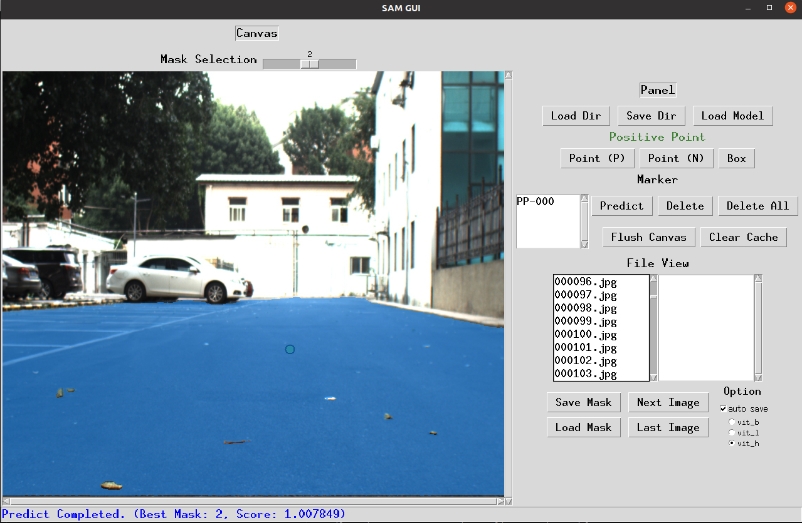

#   Segmentation Anything Model GUI
A GUI of [Segmentation Anything Model (SAM)](https://github.com/facebookresearch/segment-anything) Powered by Tkinter.

* Install requirements of [SAM](https://github.com/facebookresearch/segment-anything) (`pip install git+https://github.com/facebookresearch/segment-anything.git`)
* Download a SAM checkpoint from [here](https://github.com/facebookresearch/segment-anything#model-checkpoints) and put it into `checkpoint/`
* Set relevant model path and type [here](https://github.com/gitouni/SAM-GUI/blob/11ac385fd0d784f37098b93237facc5ef5dfe640/config.yml#L38)
* Choose your running device (cpu or cuda) [here](https://github.com/gitouni/SAM-GUI/blob/389296954c9c737b7e4498483b1adbd1f07802a1/config.yml#L39)
* Put Images to be annotated in `img/` (or set whatever you want in [config.yml](./config.yml))
* Run our gui (`python sam_gui.py`)

# Features
- Specify directory for iteratively loading and saving images
- load SAM Model to cpu or gpu (including Exception Detection)
- Display and Interative labeling for three types of Prompts (Positive Point, Negative Point, Bounding Box)
- Status Bar for more Tips
- MessageBox for user-fridenly warnings
- Advanced options (auot-save, clear logits cache)
- Hot Keys:
* `Ctrl + S`: save current mask
* `Ctrl + P`: predict current image using existing prompts
* `Ctrl + Up`: Previous image
* `Ctrl + Down`: Next image
* `Ctrl + M`: Switch to relevant mask of the current image
* `Ctrl + L`: Load selected Mask to GUI
* `Esc`: Cancel Box prompt Labeling (if you want to terminate a Haning Box Prompt, press <Esc> or change to another Prompt Type through buttons)
